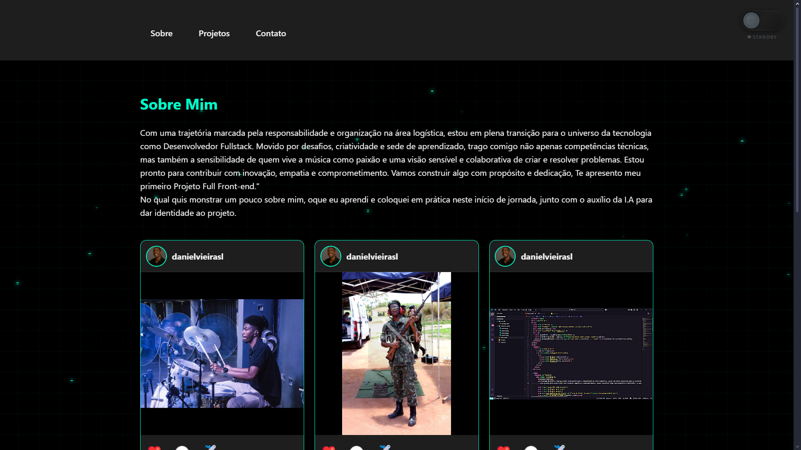

# 🌐 Portfólio Pessoal — Daniel Vieira


---

## 📜 Sobre o Projeto
Este é o meu **portfólio pessoal**, criado para apresentar minhas habilidades que estudei sobre front-end nesses ultimos 2 meses,adquirindo experiências com a I.A e conhecendo projetos de **amigos**

🎯 Objetivo:
- Mostrar meu trabalho de forma clara e atrativa.
- Facilitar o contato através das minhas redes.
- Servir como vitrine para oportunidades profissionais.

---

## ✨ Funcionalidades
- 🌗 **Modo Claro e Escuro** com transições suaves.
- 📱 **Layout Responsivo** para diferentes dispositivos.
- 🔗 **Botões de Redes Sociais**: Instagram, LinkedIn, GitHub.
- 📜 **Seção "Sobre mim"** com texto amplo e legível.

---

## 📸 Preview


---

## 🛠 Tecnologias Utilizadas
- **HTML5**
- **CSS3** (Flexbox, Responsividade)
- **JavaScript (ES6)**
- **ReactJS** *(planejado para futuras melhorias)*

---

## 🚀 Como Executar Localmente
```bash
# Clone este repositório
git clone https://github.com/DanielVieiradev/Projeto-Portifolio

# Entre no diretório
cd seu-repositorio

# Abra o arquivo index.html no navegador
